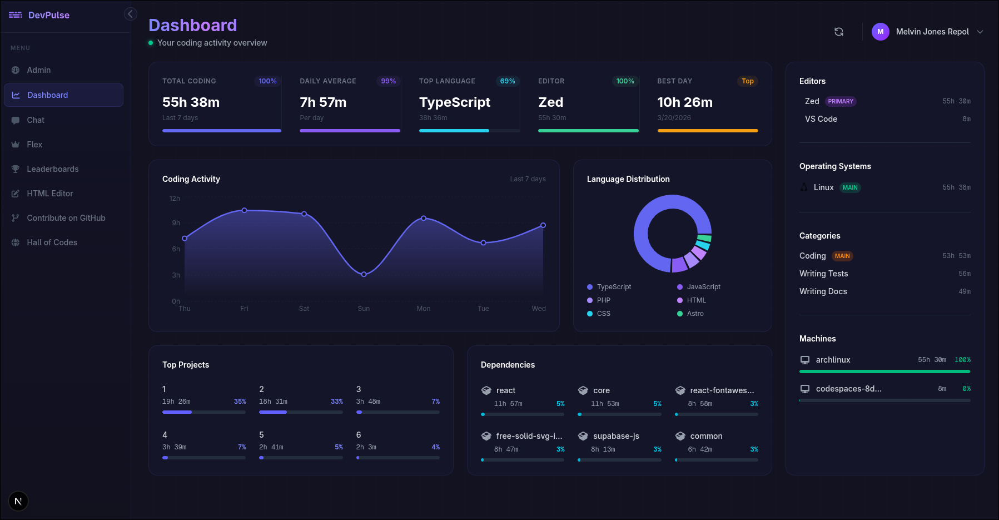

  
# devpulse

Measure and share your coding productivity with personalized leaderboards. Compare your progress with peers while keeping full control over privacy and leaderboard settings.

## Getting Started
Install the dependencies:

npm install
```

## Supabase

First by creating a supabase cloud project:

- go to [Supabase Dashboard](https://app.supabase.com)
- click `New Project`
- choose:
  - Organization → (create one if needed)
  - Project Name → e.g. devpulse-waka
  - Database Password → choose a secure one
  - Region → pick the nearest location
- Click Create new project
- Wait a few moments for the database to be provisioned.

## Setup Environment

Copy the .env.example to .env

```bash
cp .env.example .env

# Open .env and fill in the values for:
# NEXT_PUBLIC_SUPABASE_URL=your_supabase_url
# NEXT_PUBLIC_SUPABASE_ANON_KEY=your_supabase_anon_key
```

## Development

First, run the development server:

```bash
npm run dev
```

Open [http://localhost:3000](http://localhost:3000) with your browser to see the result.

## Database Migrations

For a brand-new Supabase project, use this flow from the repo root.

This repository now uses a squashed baseline migration for fresh installs:

- Active baseline: `supabase/migrations/20260407120000_baseline_fresh_setup.sql`

- Historical migrations archive: `supabase/migrations_archive/`

1. Login to Supabase CLI:

```bash
npx supabase login
```

2. Initialize local Supabase config (only if missing):

```bash
npx supabase init
```

3. Link this repo to your cloud project:

```bash
npx supabase link
```

You can select from the project list, or run `npx supabase link --project-ref <project-ref>`.

4. Push all migrations to the new project:

```bash
npx supabase db push
```

On a fresh project this applies only the single baseline migration.

5. (Optional) Pull remote schema changes into migrations:

```bash
npx supabase db pull
```

6. Regenerate Supabase TypeScript types after schema changes:

```bash
npx supabase gen types typescript --project-id <project-id> --schema public > app/supabase-types.ts
```

If you want to re-run the full migration chain on local development:

```bash
npx supabase db reset
```

If you need to inspect migration history, use the files in `supabase/migrations_archive/`.


## Learn More

To learn more about Next.js, take a look at the following resources:

- [Next.js Documentation](https://nextjs.org/docs) - learn about Next.js features and API.
- [Learn Next.js](https://nextjs.org/learn) - an interactive Next.js tutorial.

You can check out [the Next.js GitHub repository](https://github.com/vercel/next.js) - your feedback and contributions are welcome!

## Deploy on Vercel

The easiest way to deploy this Next.js app is to use the [Vercel Platform](https://vercel.com/new/clone?repository-url=https://github.com/mrepol742/devpulse) from the creators of Next.js.

Check out our [Next.js deployment documentation](https://nextjs.org/docs/app/building-your-application/deploying) for more details.

## Contribution Guidelines

Contributions to devpulse are welcome! Please follow these guidelines:

1. Before modifying any existing design or logic that is already working or in use, **contact us first** to avoid conflicts.
2. You are welcome to contribute new features, bug fixes, or improvements.
3. Check the Issues tab (if available) before starting to avoid duplicate work.
4. Follow the existing code style and conventions.
5. Submit a pull request with a clear description of your changes and the problem it solves.

> Pull requests that modify existing working features without prior discussion may not be merged.

Help us keep the codebase ("DevPulse") clean, stable, and maintainable.

## License
This project is licensed under the MIT License - see the [LICENSE](LICENSE) file for details.
