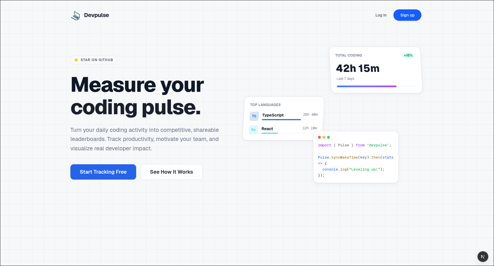

# devpulse

Measure and share your coding productivity with personalized leaderboards. Compare your progress with peers while keeping full control over privacy and leaderboard settings with project management features.

## Getting Started

Install the dependencies:

npm install

````

## Setup Environment

Copy the .env.example to .env

```bash
cp .env.example .env
````

and fill in the values for the environment variables.

## Development

First, run the development server:

```bash
npm run dev
```

Open [http://localhost:3000](http://localhost:3000) with your browser to see the result.

## Contribution Guidelines

Contributions to devpulse are welcome! Please follow these guidelines:

1. Before modifying any existing design or logic that is already working or in use, **contact us first** to avoid conflicts.
2. You are welcome to contribute new features, bug fixes, or improvements.
3. Check the Issues tab (if available) before starting to avoid duplicate work.
4. Follow the existing code style and conventions.
5. Submit a pull request with a clear description of your changes and the problem it solves.

> Pull requests that modify existing working features without prior discussion may not be merged.

Help us keep the codebase ("Devpulse") clean, stable, and maintainable.

## License

This project is licensed under the MIT License - see the [LICENSE](LICENSE) file for details.
